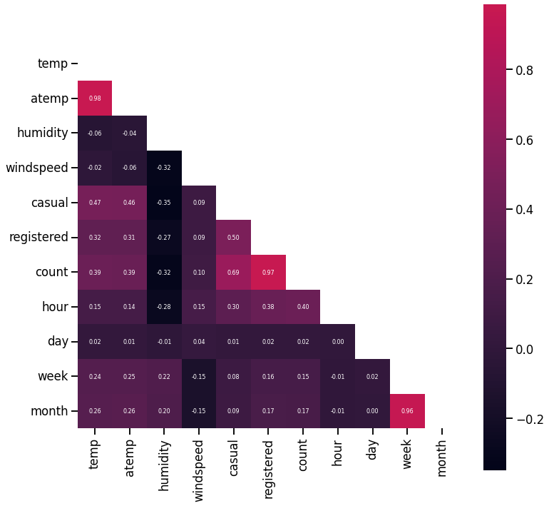
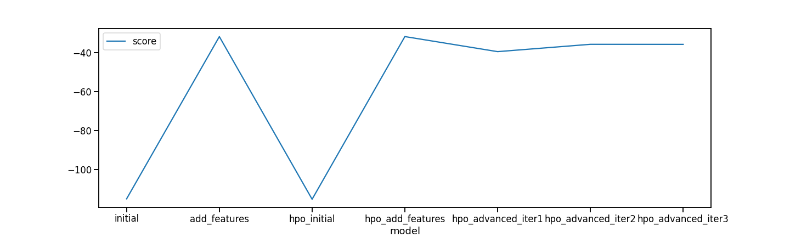
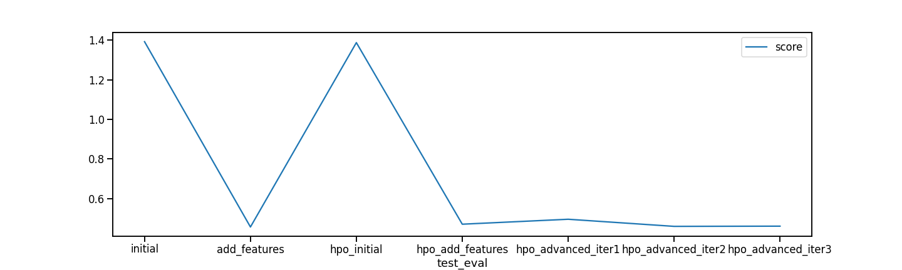

# Report: Predict Bike Sharing Demand with AutoGluon Solution
#### Elvyna Tunggawan

## Initial Training
### What did you realize when you tried to submit your predictions? What changes were needed to the output of the predictor to submit your results?

The target prediction value of this task is count of bike sharing demand, i.e., the value must be nonnegative (> 0). The Kaggle competition also use Root Mean Squared Logarithmic Error (RMSLE) as the evaluation metric to determine the scores of each submission in the leaderboard. Logarithm of negative values are undefined; that's why we have to convert negative values before we submit the predictions to Kaggle. In this case, we convert negative values to zero.

### What was the top ranked model that performed?

Using the original feature set and the instructions for AutoGluon training set up (600 seconds time limit to find the best quality model), we got a Weighted Ensemble model as the top performing one (evaluated based on root mean squared error: -114.938). Note that the results may vary depends on the machine that we're using, i.e., when I accidentally used `g4dn.xlarge` on Sagemaker Studio, I got a Weighted Ensemble model with evaluation RMSE = -114.66. *It suggests that if the feature sets are minimum, using a large machine to do a exhaustive search of the best performing model won't help much.*

I haven't found if we can figure out what the underlying models under the Weighted Ensemble model, but it has the following hyperparameters (we use the default hyperparameters - without any hyperparameter optimisation):
```json
{
    "use_orig_features": False,
    "max_base_models": 25,
    "max_base_models_per_type": 5,
    "save_bag_folds": True
}
```

Most likely, the ensemble is constructed based on other individual models that are listed in the leaderboard (Neural Network, LightGBM, CatBoost, k-nearest neighbours, etc.).

On the Kaggle leaderboard, it results in 1.3922 RMSLE.


## Exploratory data analysis and feature creation
### What did the exploratory analysis find and how did you add additional features?
To get a high level understanding of the data, we aggregate the hourly data into daily, then observe the demand pattern. Interestingly, it frequently has notably low demand for two or three days in a row, before getting back to normal. This finding suggests that "day of week" could be an important feature. We also extract other time information, namely: `day`, `day_of_week`, `week`, `month`.


Based on the Pearson correlation, we observe moderately positive correlation between bike sharing demand and hour of day, which makes sense - people might rent bike when they have to commute for work. 



Note: `casual` and `registered` have strong correlation with the demand, which make sense since these columns represents the number of non-registered and registered users that rent the bike. We don't use them for model training.

Temperature (`temp` and `atemp`) also has a positive correlation with the bike sharing demand. In contrast, humidity is negatively correlated with the demand. Generally, day with a higher windspeed has a lower demand - however, there are some extreme values.


We categorise the hour of day into several categories: morning commute (7 to 9 AM), lunch time (11 AM to 1 PM), evening commute (5 to 6 PM), and the rest as "others". We also change the data type of categorical and boolean variables: `season`, `weather`, `holiday`, `workingday`, and `day_of_week`.

On working days, demand at the evening and morning commute are higher; whereas on weekends, demand are higher around lunch time and other hours.


### How much better did your model perform after adding additional features and why do you think that is?

We train another model with these features:

```python
[[
    'datetime', 'season', 'holiday', 'workingday', 
    'weather', 'temp','atemp', 
    'humidity', 'windspeed', 
    'hour', 'day', 'day_of_week',
    'week', 'month', 'hour_activity'
]]
```

It results in a pretty good improvement: 0.45711 RMSLE, still comes from a Weighted Ensemble model (evaluation RMSE: -31.88). Having the appropriate data types for categorical features inform the model to handle them better when it learns the pattern in the training data. Additionally, ensemble models are trained based on multiple simpler models. The simpler models could be trained using subset of the training data and the feature sets, e.g., in Random Forest or LightGBM. Hence, if there are more relevant features, the simpler models could learn better and construct a more accurate ensemble.

The following figure shows the feature importances on this iteration. Hour and day of week have high importance to predict the demand, while week of year isn't.


## Hyper parameter tuning
### How much better did your model perform after trying different hyper parameters?
TODO: Add your explanation

### If you were given more time with this dataset, where do you think you would spend more time?

If I have more time to improve the model, I'd focus on the EDA and feature engineering. Since we are using Auto ML (AutoGluon basically does this), we can pass on the relevant features; AutoGluon will train multiple models and find the best performing one given the constraints that we give (e.g., training time).

Spending too much time on hyperparameter tuning, e.g., set a larger hyperparameter search space, may result in overfitting; especially since currently we don't split the data into train and validation sets. It would be better to do this, to get an unbiased estimates during the hyperparameter tuning.

### Create a table with the models you ran, the hyperparameters modified, and the kaggle score.
|model|hpo1|hpo2|hpo3|score|
|--|--|--|--|--|
|initial|N/A|N/A|N/A|1.39222|
|add_features|N/A|N/A|N/A|0.45711|
|hpo initial (basic)|time_limit = 120|num_trials = 5|search_strategy = 'auto'|1.38739|
|hpo add_features (basic)|time_limit = 120|num_trials = 5|search_strategy = 'auto'|0.47117|
|hpo add_features (advanced) - NN and LightGBM|time_limit = 120|num_trials = 5|search_strategy = 'auto'|0.49612|
|hpo add_features (advanced) - more models|time_limit = 120|num_trials = 5|search_strategy = 'auto'|0.46025|
|hpo add_features w/o 'week' (advanced) - more models|time_limit = 120|num_trials = 5|search_strategy = 'auto'|0.46126|

Find the hyperparameter search space details for `hpo add_features` below (or in `Step 6 > Model-specific HPO ` sections of the notebook).

```python
nn_options = { 
    'num_epochs': 10,
    'learning_rate': ag.space.Real(1e-4, 1e-2, default=5e-4, log=True),
    'activation': ag.space.Categorical('relu', 'softrelu', 'tanh'), 
    'layers': ag.space.Categorical([100], [1000], [200, 100], [300, 200, 100]),  
    'dropout_prob': ag.space.Real(0.0, 0.5, default=0.1),  
}

gbm_options = {
    'num_boost_round': 100,
    'num_leaves': ag.space.Int(lower=20, upper=66, default=36),
    'max_depth': ag.space.Int(lower=3, upper=15, default=5),
    'feature_fraction': ag.space.Real(0.1, 0.8, default=0.6),
    'bagging_freq': ag.space.Int(lower=1, upper=5, default=2),
    'bagging_fraction': ag.space.Real(0.4, 0.8, default=0.6),
    'learning_rate': ag.space.Real(0.05, 0.3, default=0.07),
    
}

cat_options = {
    'depth': ag.space.Int(lower=4, upper=10, default=6),
    'learning_rate': ag.space.Real(0.05, 0.3, default=0.07),
    'iterations': ag.space.Int(lower=5, upper=50, default=5),
    'l2_leaf_reg': ag.space.Real(0.05, 1.5, default=0.2),
    'random_strength': ag.space.Real(0.2, 0.9, default=0.2),
    'bagging_temperature': ag.space.Real(0.4, 0.8, default=0.6),
}

xgb_options = {
    'max_leaves': ag.space.Int(lower=20, upper=66, default=36), 
    'max_depth': ag.space.Int(lower=3, upper=15, default=6),
    'colsample_bytree': ag.space.Real(0.1, 0.8, default=0.6),
    'subsample': ag.space.Real(0.4, 0.8, default=0.6),
    'learning_rate': ag.space.Real(0.05, 0.3, default=0.07),
}

fastai_options = {
    'lr': ag.space.Real(0.05, 0.3, default=0.07),
}

```

### Create a line plot showing the top model score for the three (or more) training runs during the project.

TODO: Replace the image below with your own.



### Create a line plot showing the top kaggle score for the three (or more) prediction submissions during the project.

TODO: Replace the image below with your own.



## Summary
TODO: Add your explanation