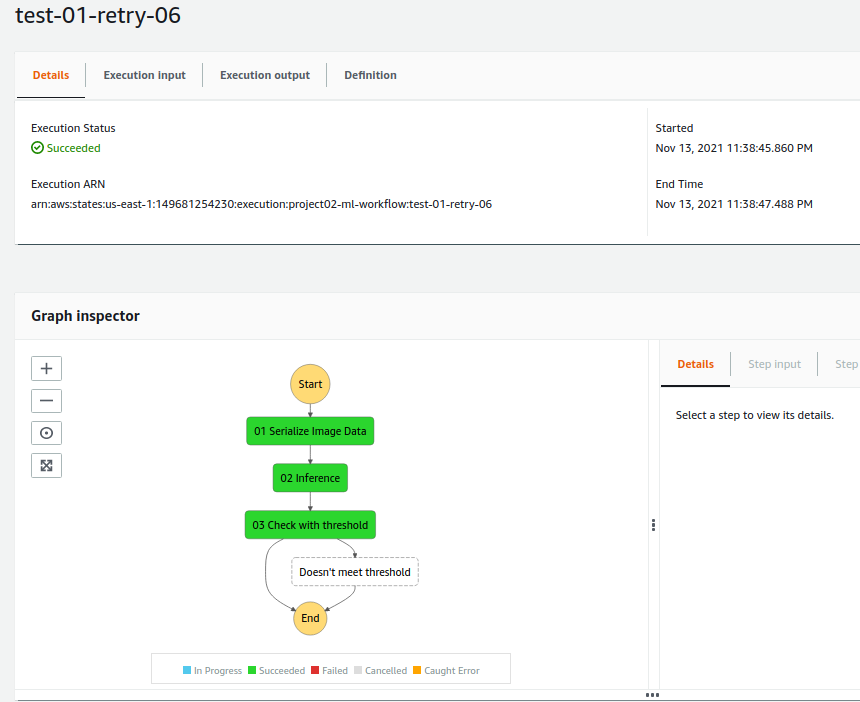
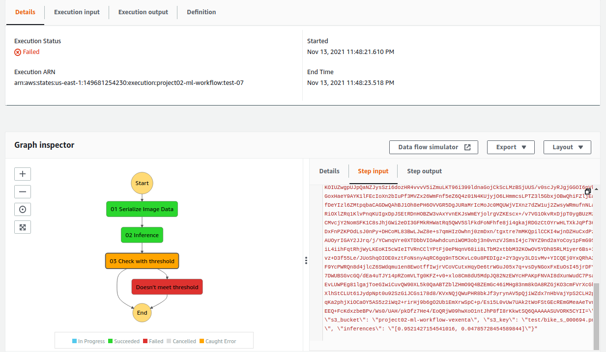

# Build a ML Workflow For Scones Unlimited On Amazon SageMaker

## Description

In this project, we use pretrained image classification model from Sagemaker to identify bicycle or motorbike images. The images are retrieved from [CIFAR dataset](https://www.cs.toronto.edu/~kriz/cifar-100-python.tar.gz).

The model is trained using Sagemaker Training job, with data capture and model monitoring configured to identify changes in the input data and model performance. To automate the process, we use Step Function to orchestrate several Lambda functions:
1. Encode input image to base64
2. Pass the encoded image to the model endpoint
3. Validate whether the inference passes the confidence threshold

Following are examples of the step function executions:





Detailed descriptions are available on `workspace/project-notebook.ipynb`.


## Project Directory

```
├── README.md          <- description of the repo
├── img                <- screenshots of the working step functions
│
├── src                <- scripts
│   ├── lambda         <- lambda functions
│   └── step-function  <- step function definition
│
└── workspace          <- contain project notebook (and relevant files generated from it)
```


## Rubric

Copied from the Udacity project rubric.

### Train and Deploy a Machine Learning Model

- [x] Setup a SageMaker studio and a kernel to run this project
- [x] Students have completed the ETL (extract, transform, load) section of the starter code
- [x] Students have successfully completed the Model training section up to “Getting ready to deploy”, showing they trained an image classification model
- [x] Students have successfully completed the “Getting ready to deploy” section, showing they have deployed a trained ML model
- [x] Students have a unique model endpoint name printed in their notebook for use later in the project
- [x] Successfully made predictions using a sample image

### Build a full machine learning workflow

- [x] Students have authored three lambda functions & have saved their code for each lambda function in a python script.
  - [x] 1st lambda is responsible for return an object to step function as `image_data` in an event
  - [x] 2nd lambda is responsible for image classification
  - [x] 3rd lambda is responsible for filtering low-confidence inferences
- [x] Compose Lambdas together in a Step Function
- [x] Students will have a JSON export that defines the Step Function
- [x] Students have a screenshot of the working Step Function

### Monitor the model for errors

- [x] Students load the data from Model Monitor into their notebook
- [x] Students create their own visualization of the Model Monitor data outputs

## Suggestions to Make Your Project Stand Out

1. Extend your workflow to incorporate more classes: the CIFAR dataset includes other vehicles that Scones Unlimited can identify with this model.
2. Modify your event driven workflow: can you rewrite your Lambda functions so that the workflow can process multiple image inputs in parallel? Can the Step Function "fan out" to accommodate this new workflow?
3. Consider the test data generator we provided for you. Can we use it to create a "dummy data" generator, to simulate a continuous stream of input data? Or a big parallel load of data?
4. What if we want to get notified every time our step function errors out? Can we use the Step Functions visual editor in conjunction with a service like SNS to accomplish this? Try it out!
5. Write a project README to showcase your project. You can share screencaps of your solution working in Step Functions, your visualization of the ML Model, or any other stretch goals that you pursued and how that went for you


