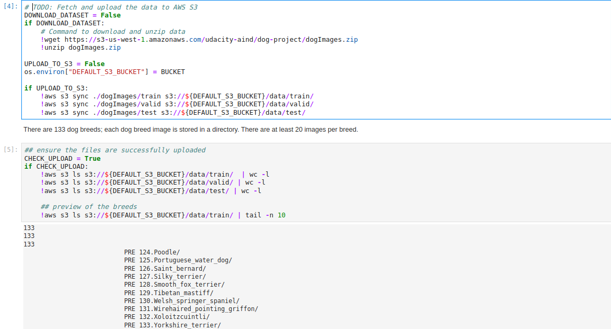

# Image Classification on Sagemaker

# Description

We use [dog breed image datasets](http://vision.stanford.edu/aditya86/ImageNetDogs/), which contain 133 different breeds. To classify each breed, we use pretrained VGG16 model. This project heavily uses PyTorch and AWS Sagemaker.

The repository is structured as follows.

```
├── README.md          <- description of the repo
├── img                <- screenshots for the README
│
├── workspace          <- scripts and notebook
│   ├── src            <- training and hp tuning script
└─  └── project-notebook.ipynb  <- notebook to run scripts as Sagemaker jobs
```

Note: find the project starter template [here](https://github.com/udacity/nd009t-c3-deep-learning-topics-within-computer-vision-nlp-project-starter).

# How to run the script

## Data storage

The images are stored in an S3 bucket, then they are passed as inputs to the Sagemaker training jobs.




## Hyperparameter tuning and model training

TO DO: *What kind of model did you choose for this experiment and why? Give an overview of the types of parameters and their ranges used for the hyperparameter search*

Remember that your README should:
- Include a screenshot of completed training jobs
- Logs metrics during the training process
- Tune at least two hyperparameters
- Retrieve the best best hyperparameters from all your training jobs

## Model debugging and profiling

**TODO**: Give an overview of how you performed model debugging and profiling in Sagemaker

### Results
**TODO**: What are the results/insights did you get by profiling/debugging your model?

**TODO** Remember to provide the profiler html/pdf file in your submission.


## Model Deployment
**TODO**: Give an overview of the deployed model and instructions on how to query the endpoint with a sample input.

**TODO** Remember to provide a screenshot of the deployed active endpoint in Sagemaker.

## Standout Suggestions
**TODO (Optional):** This is where you can provide information about any standout suggestions that you have attempted.


# References

- [Building your own algorithm container](https://notebooks.githubusercontent.com/view/ipynb?browser=chrome&color_mode=light&commit=ee8371c5185def1303ede5880331f71cdf68ef6e&device=unknown_device&enc_url=68747470733a2f2f7261772e67697468756275736572636f6e74656e742e636f6d2f6177732f616d617a6f6e2d736167656d616b65722d6578616d706c65732f656538333731633531383564656631333033656465353838303333316637316364663638656636652f616476616e6365645f66756e6374696f6e616c6974792f7363696b69745f6272696e675f796f75725f6f776e2f7363696b69745f6272696e675f796f75725f6f776e2e6970796e62&logged_in=true&nwo=aws%2Famazon-sagemaker-examples&path=advanced_functionality%2Fscikit_bring_your_own%2Fscikit_bring_your_own.ipynb&platform=linux&repository_id=107937815&repository_type=Repository&version=96#An-overview-of-Docker)
- [VGG16](https://www.kaggle.com/carloalbertobarbano/vgg16-transfer-learning-pytorch)
- [VGG16 Analytics Vidhya](https://www.analyticsvidhya.com/blog/2021/06/transfer-learning-using-vgg16-in-pytorch/)
- [Dog breed](https://levelup.gitconnected.com/dog-breed-classifier-with-pytorch-using-transfer-learning-8f15af6f9010)
- [Pretrained examples with Keras](https://machinelearningmastery.com/how-to-use-transfer-learning-when-developing-convolutional-neural-network-models/)
- [Airy example](https://www.kaggle.com/zscansorted/airy-photo-challenge-transfer-learning-tutorial)
