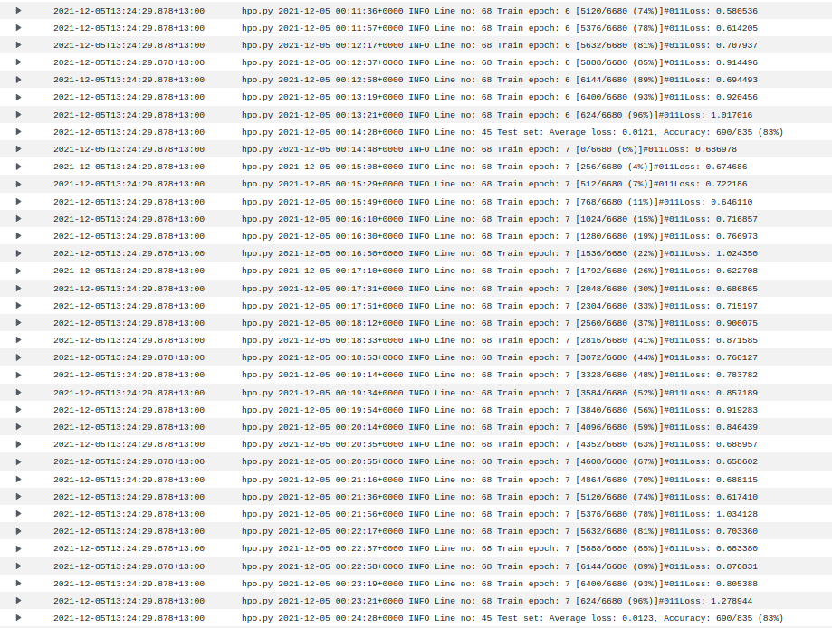
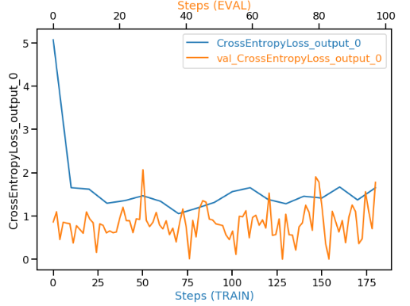

# Image Classification on Sagemaker

# Description

We use [dog breed image datasets](http://vision.stanford.edu/aditya86/ImageNetDogs/), which contain 133 different breeds. To classify each breed, we use pretrained VGG16 model. This project heavily uses PyTorch and AWS Sagemaker.

The repository is structured as follows.

```
├── README.md          <- description of the repo
├── img                <- screenshots for the README
|
├── profiler-output    <- output report from Sagemaker Profiling
│
├── template           <- project starter files
|
├── workspace          <- scripts and notebook
│   ├── src            <- python scripts used in the notebook
└─  └── project-notebook.ipynb  <- notebook to run scripts as Sagemaker jobs
```

Note: find the project starter template [here](https://github.com/udacity/nd009t-c3-deep-learning-topics-within-computer-vision-nlp-project-starter).

# How to run the script

## Data storage

The images are stored in an S3 bucket, then they are passed as inputs to the Sagemaker training jobs.


## Hyperparameter tuning and model training

Here, we use a pretrained [VGG16](https://neurohive.io/en/popular-networks/vgg16/) model because of its simple structure (not having too deep network architecture) and easy to fine-tune for starters. I also tried fine-tuning [ResNet18](https://pytorch.org/hub/pytorch_vision_resnet/) - which is much faster to train, but didn't get a satisfactory result. VGG16 outperforms ResNet18 in this case, since lower-level features become more important to identify these 133 dog breeds.

We tune three hyperparameters: training batch size, learning rate, and number of epoch. 
- The hyperparameter search range for batch size is kept small (since larger batch size requires more computing power, i.e., more expensive instances). 
- For a similar reason, the number of epochs are also kept small (to avoid longer training process).
- The search space for learning rate is defined between 0.001 and 0.1. We also use [Adam](https://machinelearningmastery.com/adam-optimization-algorithm-for-deep-learning/) as the optimizer, which adapts the learning rate value while optimizing the objective function.

```py
hyperparameter_ranges = {
    "lr": ContinuousParameter(0.001, 0.1),
    "batch-size": CategoricalParameter([128, 256]),
    "epochs": CategoricalParameter([5, 7, 10])
}
```

The hyperparameter tuning is conducted by finding hyperparameter values that perform the best on the validation set.





Following is the best hyperparameter found from the hyperparameter tuner:

```py
hyperparameters = {
    "lr": 0.0053945745752048664,
    "batch-size": 256,
    "epochs": 7,
}
```

## Model debugging and profiling

To allow model debugging and profiling for the model training job, we need to define several rules:

```py
from sagemaker.debugger import Rule, ProfilerRule, rule_configs, DebuggerHookConfig, ProfilerConfig, FrameworkProfile, CollectionConfig

rules = [
    Rule.sagemaker(rule_configs.loss_not_decreasing()),
    Rule.sagemaker(rule_configs.overfit()),
    Rule.sagemaker(rule_configs.overtraining()),
    Rule.sagemaker(rule_configs.poor_weight_initialization()),
    ProfilerRule.sagemaker(rule_configs.LowGPUUtilization()),
    ProfilerRule.sagemaker(rule_configs.ProfilerReport()),
]

profiler_config = ProfilerConfig(
    system_monitor_interval_millis=500, framework_profile_params=FrameworkProfile(num_steps=10)
)

collection_config_list = [
    CollectionConfig(
        name="CrossEntropyLoss_output_0",
        parameters={
            "include_regex": "CrossEntropyLoss_output_0", 
            "train.save_interval": "10",
            "eval.save_interval": "1"
        }
    )
]

hook_config = DebuggerHookConfig(
    collection_configs=collection_config_list
)
```

If we don't define `CollectionConfig`, the Debugger might not capture the defined metric (here, `CrossEntropyLoss_output_0`) for all training steps. 

Then, the `profiler_config` and `hook_config` are passed as additional arguments for the `Estimator`. Aside from setting the arguments, we also have to ensure that the `hook` are set up in the `src/train_model.py`:
- set the mode to `TRAIN` if it is on the training step
- set the mode to `EVAL` if it is on the testing step

Read more re CollectionConfigs [here](https://docs.aws.amazon.com/sagemaker/latest/dg/debugger-configure-hook.html).


### Results



The validation loss is unstable and doesn't decrease as the model is trained with more iterations. It implies that the model might not perform well - we could consider revisiting our hyperparameter search range (e.g., reducing batch size, increasing epochs) and do more hyperparameter tuning. Alternatively, we might consider using different pretrained model, or design the additional layers differently.

I didn't use instance with GPU - that's why we only observe CPU utilizations in the Profiling Report. Overall, there are no issues - none of the profiling rules were triggered. The full report is provided on `profiler-output/profiler-report.html`.

## Model Deployment

I found a lot of issues while trying to query the deployed model endpoint. Ideally, preparing an entry point for the model inference alongside the model data should work:

```py
model_location = "s3://project03-image-classification-vexenta/model/vgg16-model-train-with-model-fn.tar.gz"
pytorch_model = PyTorchModel(
    model_data=model_location, 
    role=role,
    entry_point='src/inference.py',
    py_version='py3',
    framework_version='1.4',
    predictor_cls=ImagePredictor
)

predictor = pytorch_model.deploy(
    initial_instance_count=1, 
    instance_type='ml.m5.large'
)
```

These commands will deploy the model and create an endpoint.


The inference script already handles the data transformation to tensors, so we only need to pass image in bytes format as the payload for the endpoint.

```py
sample_image_path = "dogImages/test/002.Afghan_hound/Afghan_hound_00116.jpg"

with open(sample_image_path, "rb") as f:
    payload = f.read()

response = predictor.predict(
    payload,
    initial_args={
        "ContentType": "image/jpeg"
    }
)

print(response)
```

The `response` stores an array of length 133, which represents the prediction for each class. To identify the predicted class, we can use `numpy.argmax()` function - it will return the index of the predicted class (which is aligned with the index of the dog breed folders).


As mentioned before, I found an issue: somehow my trained VGG16 model couldn't be loaded although it's already deployed as the endpoint ([despite using different ways to deploy](https://knowledge.udacity.com/questions/759044)). I've tried using the inference script locally - it successfully loads the model object and could run the prediction. 

Regardless, to demonstrate the deployment and invoking the endpoint, I trained a smaller Resnet50 model (trained using 50 epochs) which has a worse accuracy. Using the previous code chunk, we could retrieve the predicted class from the endpoint. The following figure shows the success response (200 HTTP code) in Cloudwatch Logs.

