# Operationalizing AWS Machine Learning Project

In this project, we complete the following steps:

1. Train and deploy a model on Sagemaker, using the most appropriate instances. Set up multi-instance training in your Sagemaker notebook.
2. Adjust your Sagemaker notebooks to perform training and deployment on EC2. 
3. Set up a Lambda function for your deployed model. Set up auto-scaling for your deployed endpoint as well as concurrency for your Lambda function.
4. Ensure that the security on your ML pipeline is set up properly.

The starter codes are provided under `template` directory.

The repository is structured as follows.

```
├── README.md          <- description of the repo, alongside the explanation of the design choices
├── writeup.pdf        <- explanation of the design choices
├── img                <- related screenshots for the writeup
│
├── template           <- project starter files
|
├── workspace          <- scripts and notebook
│   ├── src            <- relevant python scripts
└─  └── project-notebook.ipynb  <- notebook to run scripts as Sagemaker jobs
```

# 1. Initial setup, training, and deployment

## a. Setup

First, we create a Sagemaker notebook instance. We select the `ml.t2.medium` instance, which has 2 vCPU and 4GB of RAM, since it is quite cheap ($0.0464 per hour). Additionally, we only run a lightweight task in the notebook to trigger Sagemaker training jobs and create endpoint. Hence, this instance type should fit our needs.

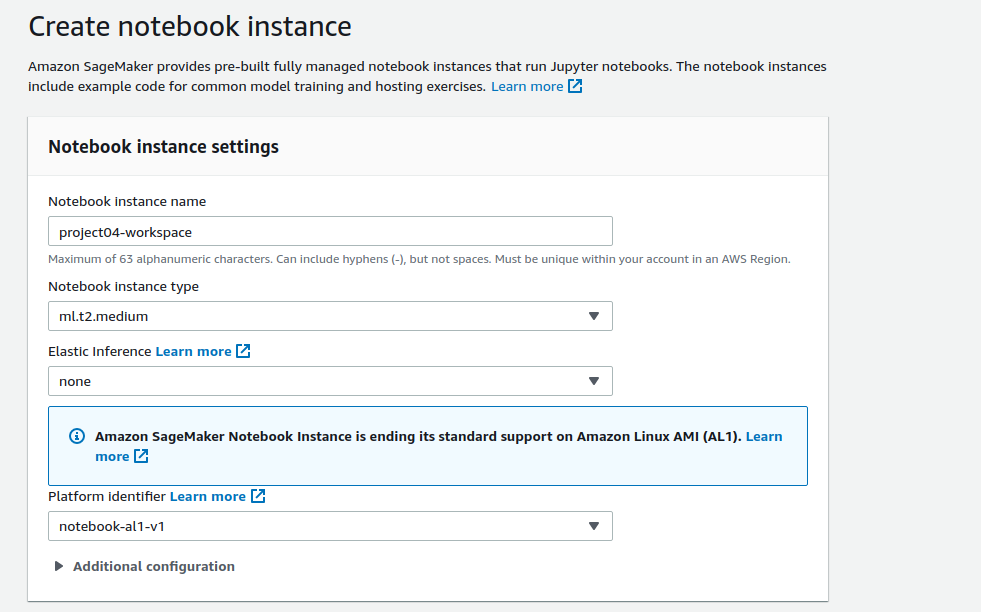
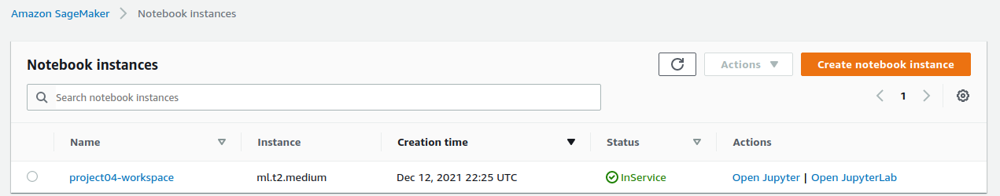

## b. Training

Then, we open the Jupyterlab and upload the relevant notebook and Python scripts to that instance. Based on the best hyperparameter values from the hyperparameter tuning job, we run the training job twice: 1) using single instance, and 2) using multi-instance training (in this example, we use 4 instances of `ml.m5.xlarge`). 

The single instance training takes around 22 minutes, while the multi-instance training takes around 21 minutes (no huge differences here).

Preview of the single-instance training job.
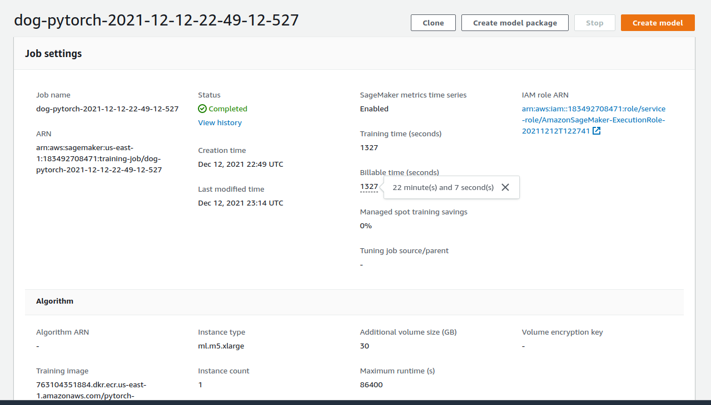
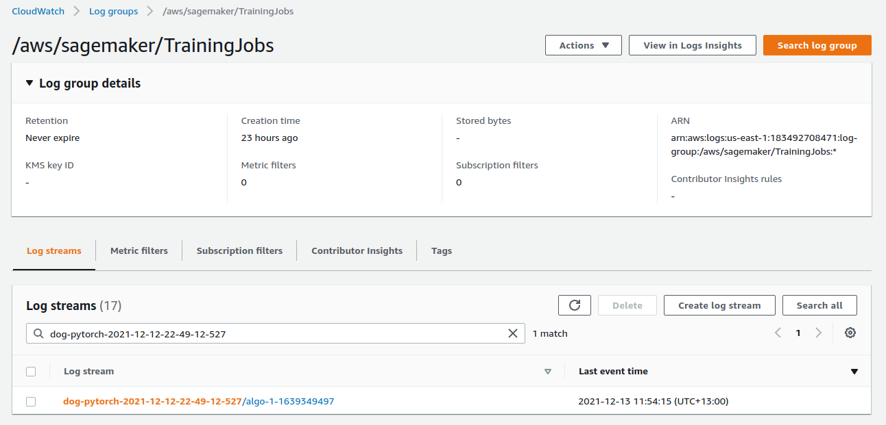

Preview of the multi-instance training job.
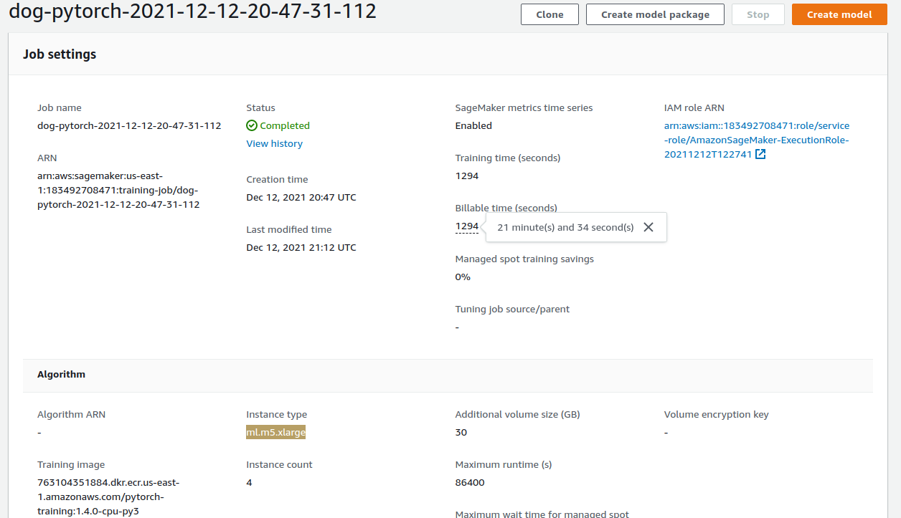
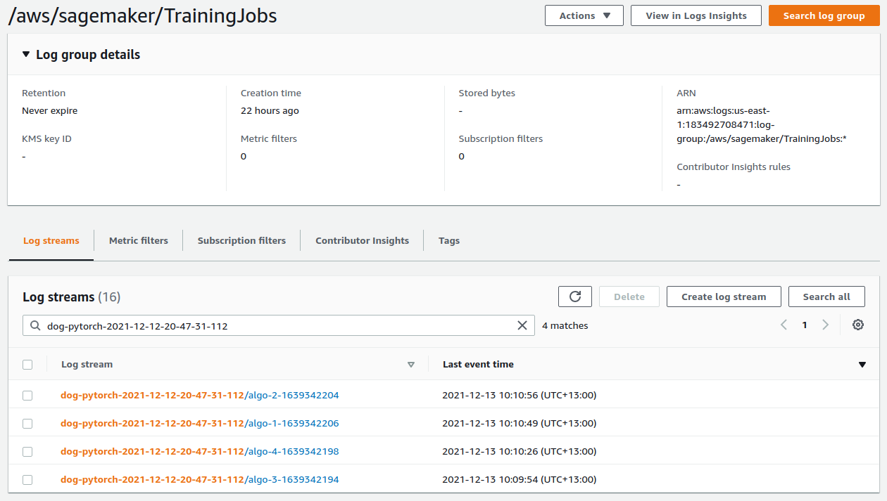

In terms of model performance, the difference is negligible. The single instance training results in 580 testing loss, while the multi-instance has 581 testing loss. Following figures show the logs from each training job.

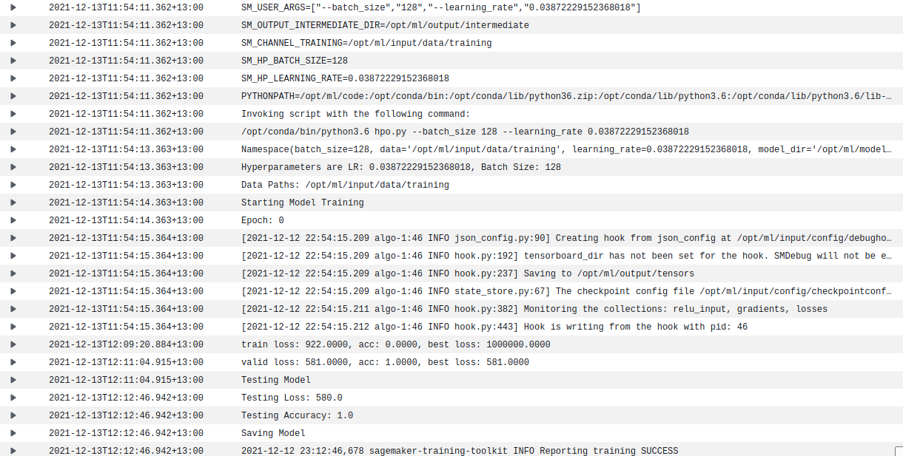

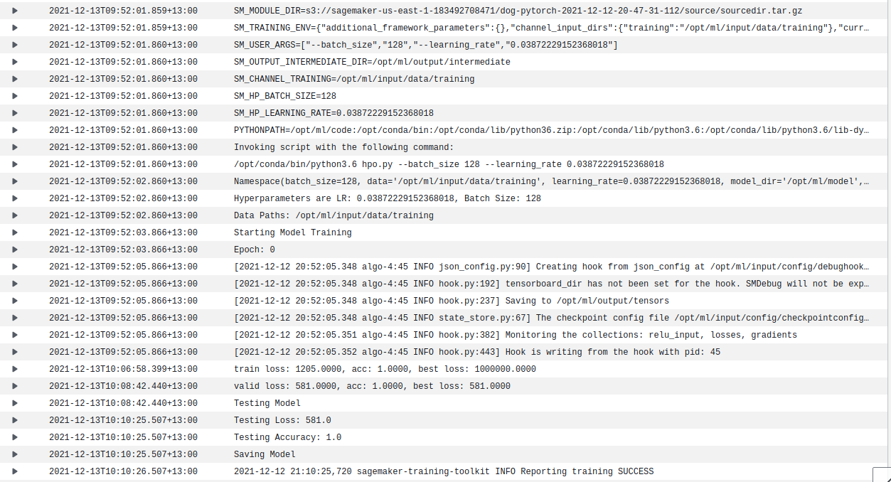

# 2. Training on EC2 instance

Here, we train a similar image classification model using an EC2 instance without changing any default hyperparameters from the starter script. We decide to use `t2.medium` instance (2 vCPU and 4 GB of RAM) since the training script only requires 5 epochs and the batch size is only (2). If the batch size is larger, we will need to use an instance with bigger RAM. We don't request a spot instance to ensure the instance is preserved to our work.

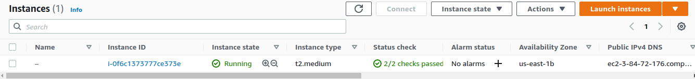

The data are downloaded and unzipped using the command line. To ensure it's reproducible easily, we put the commands in `workspace/src/ec2-data-download.sh`.


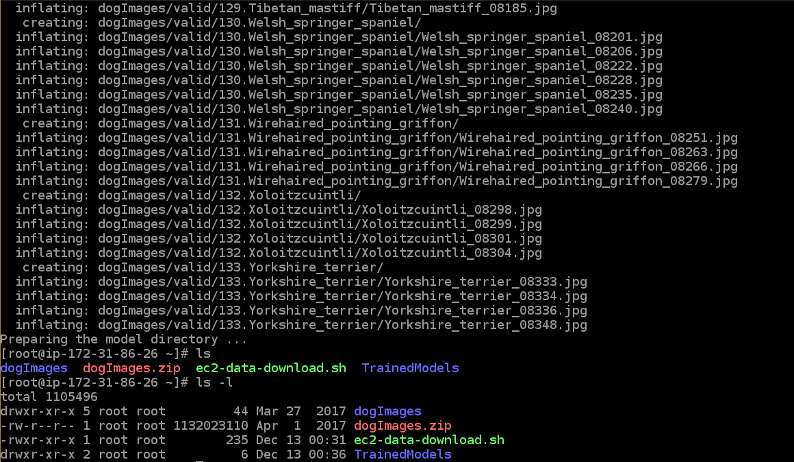

We need to activate the right conda environment: `source activate pytorch_latest_p37` - otherwise, the default python environment doesn't have Pytorch installed.

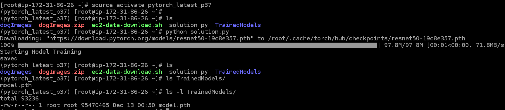
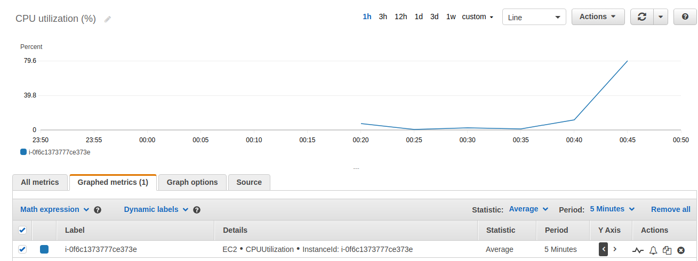

Both scripts that we run using Sagemaker and EC2 train a similar Pytorch model. However, when we run it on Sagemaker, we have to pass the input and output data (datasets, model) as environment variables. It has to be done that way since every time we trigger Sagemaker training jobs, they could be executed on different instances. Meanwhile, when we train a model on EC2, we can directly use local datasets and store the model right on the EC2 instance (since the storage is persistent, unless we delete the instance). The remaining part of the code is quite similar (but we should note that the EC2 training script has the hyperparameters hard-coded rather than specified as command line arguments).

# 3. Lambda function setup

The lambda function receives a JSON input that contains URL of an image, then, it instantiates a Sagemaker runtime object to invoke our deployed endpoint from part #1. The response from that endpoint is stored as the response body of the lambda function's output. The whole preprocessing logic is handled by the endpoint (in `src/inference.py`).

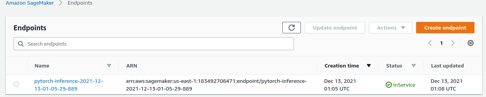

# 4. Security and testing

To ensure the Lambda function in part #3 can hit the endpoint, we need to give it access to Sagemaker. Here, we assign `SagemakerFullAccess` to the IAM role that we use on the Lambda function.

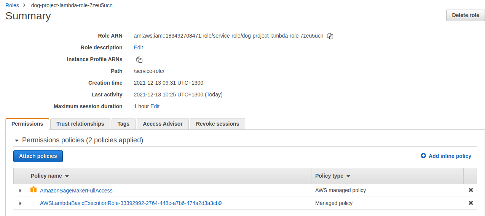
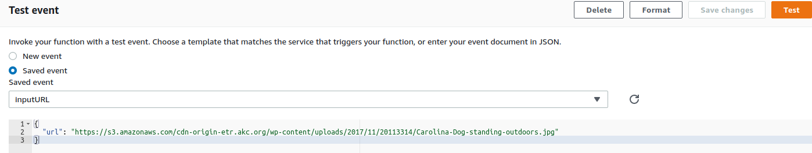
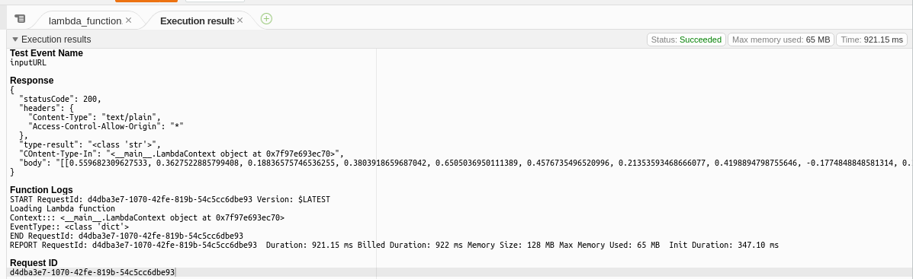

The following figure shows a preview of our IAM role dashboard. There aren't a lot of custom roles there, as this account is used specifically for this course. There are no sensitive information stored anywhere in this account (so it should be safe). However, since we assigned `SagemakerFullAccess` to the Lambda function, it allows any operations to the Sagemaker resources. Unfortunately, I don't find another role that allows invoking endpoint without giving too much control of the resources.

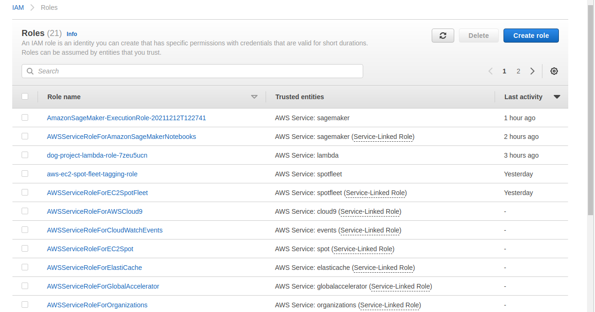

# 5. Concurrency and autoscaling

Usually, Lambda function is used to bridge the application request to the endpoint. In this example, we define a reserved concurrency and set it to 10, i.e., the Lambda function can process 10 requests at the same time.

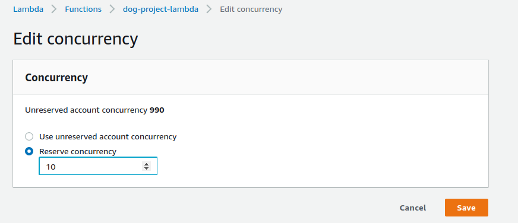

Besides, we also configure autoscaling on our endpoint. We define the maximum instance to 2 (since it is just a course example), with the threshold of 5 invocations per instance, i.e., if there are more than 5 invocations, another instance will be spinned up. The scale-in and scale-out duration are set to 30 seconds to avoid downtime.

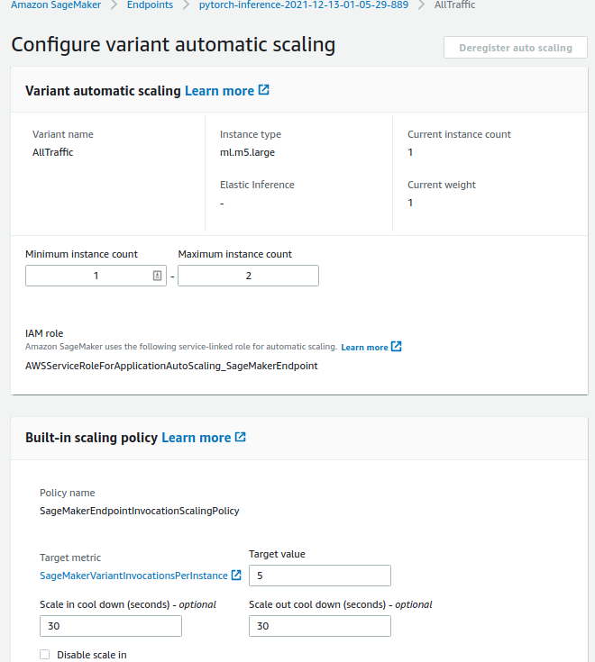