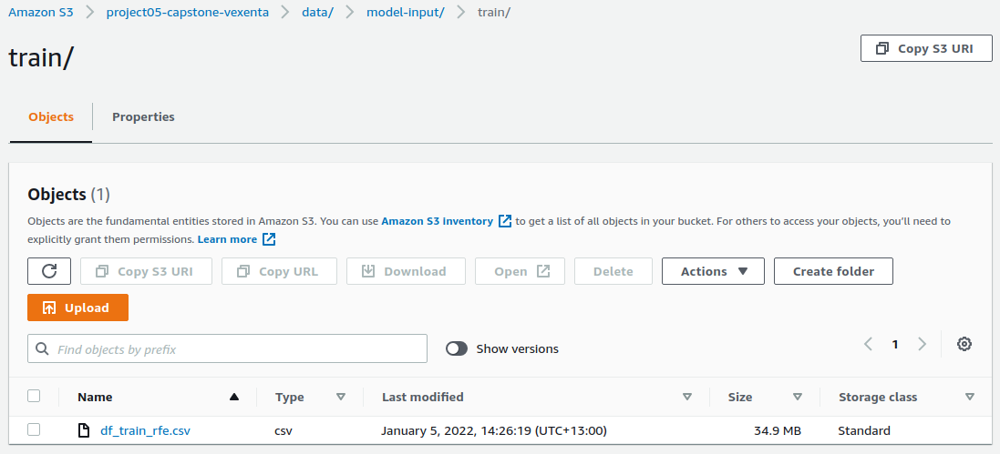

# Predicting E-Commerce Cart Abandonment

## Overview

This project is conducted as the capstone project of Udacity AWS Machine Learning Engineer Nanodegree. The dataset is taken from [Data Mining Cup 2013](https://www.data-mining-cup.com/reviews/dmc-2013/), which contains 429,013 rows of e-commerce sessions with 24 columns.

The repository is structured as follows.

```
├── README.md          <- description of the repo
|
├── requirements.in    <- list of packages used in this project
|
├── config             <- config files used on the python scripts
|
├── dataset            <- dataset used in the project
|
├── img                <- screenshots for the README
|
├── notebook           <- supporting notebooks for exploration etc.
|
├── proposal           <- files related to the project proposal
|
├── report             <- files related to the project report
|
└── src                <- scripts
```

## Project Setup

### Local

For local development, you can use `conda` or `venv`.
```sh
conda install --force-reinstall -y -q --name <env-name> -c conda-forge imbalanced-learn --file requirements.in
```

```sh
python3 -m venv work-env
source work-env/bin/activate
pip install pip-tools
pip-compile
pip-sync
```

### AWS

The notebooks stored on `notebook/sagemaker` are specifically prepared to be executed on AWS Sagemaker.

- Hyperparameter tuning: `notebook/sagemaker/00-sm-hp-tuning.ipynb`
- Final model training and deployment: `notebook/sagemaker/01-sm-train-deploy.ipynb`

These notebooks refer to Python scripts stored in `src/modelling`. Find relevant screenshots of the results in `img/report/` or by reading the final report file.

Note: ensure the datasets are stored in S3, since they are referred by the model training scripts.



## Future Improvements

### Modelling

- Further exploratory analysis to identify more important features to be engineered
- Try using embedding methods, such as autoencoders
- Explore different algorithms, such as using neural networks and Shapley values to allow model interpretability
- Further hyperparameter tuning


### ML Ops

- Code refactoring for better code readability and maintenance
- Move hard-coded variables names into configuration files
- Write unit tests and data validation scripts to ensure data quality
- Orchestrate the end-to-end scripts as step functions (require containerization) or as a Sagemaker Pipeline (run the data preprocessing and feature engineering steps as Sagemaker Processing jobs)
- Model monitoring and retraining