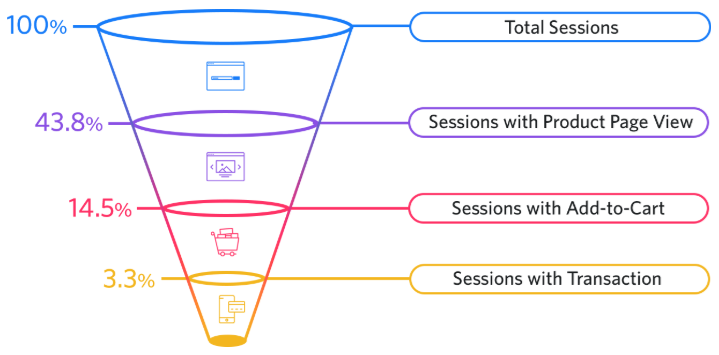

# Predicting E-Commerce Cart Abandonment

## Domain Background

In the past decade, e-commerce platforms have been rapidly growing. On a survey on Organisation for Economic Co-operation and Development (OECD) countries, it was found that more than half of the individuals made at least one online purchase within the last 12 months [^1]. Additionally, the Covid-19 pandemic resulted in a huge shift from brick-and-mortar business towards online shopping. In the UK, China, Germany, and the US, the share of retail sales from online purchases increased by 4-7% in 2020 compared to 2019 [^2]. As more people become more used to online purchases, there are increasing numbers of e-commerce platforms. To be a market leader, having a reliable platform and providing an amazing user experience become more important.

Although every e-commerce platform may require different purchasing steps, they mainly share a similar conversion funnel. To maximize their revenue, they strive to increase the overall conversion rate, i.e., aiming to convert as many web/app visitors into their customers.

Simple illustration of a conversion funnel in e-commerce platforms. Source: <a href="https://www.crazyegg.com/blog/ecommerce-conversion-funnel/">crazyegg.com</a>

[^1]: *Unlocking the Potential of E-commerce*. (2019, March). OECD. https://www.oecd.org/going-digital/unlocking-the-potential-of-e-commerce.pdf

[^2]: Alonso, V., Boar, C., Frost, J., Gambacorta, L., and Liu, J. (2021, January 12). *E-commerce in the pandemic and beyond*. Bank for International Settlements. https://www.bis.org/publ/bisbull36.pdf

One of the earlier steps of the conversion funnel is adding items into the shopping cart. Although having the cart filled is one step closer to the purchase, there are possibilities that the users will abandon their cart. For example, the users might consider a shopping cart as a helper to save the items that they're interested in. This misuse might happen since not all e-commerce platforms have a wishlist or bookmark feature. 

Some e-commerce platforms might consider protecting the inventory that has been added to a shopping cart to ensure a seamless user experience, i.e., the items will be reserved by the users although they leave the cart for hours before purchasing them. However, this method is likely to end up with huge potential losses, especially if most users frequently abandon their carts.

## Problem Statement

Instead of protecting the inventory, e-commerce platforms usually introduce nudge marketing to influence user behaviour. However, nudges might backfire if they are implemented without understanding the user behaviour [^3].

[^3]: Sanghi, R., Gupta, S., Mishra, R.C., Singh, A., Abrol, H., Madan, J., & Sagar, M. (2019). *Nudge Marketing in E-Commerce Businesses*. International Journal of Science and Research (IJSR). https://www.ijsr.net/archive/v8i8/ART2020223.pdf

Analyzing users' purchasing intent has become one of the research areas in e-commerce. Most e-commerce platforms have pivoted to more personalized features and services, which is also the case for Pinterest [^4]. Website clickstream and user session data are the main data sources to understand the purchasing intent since they contain the whole picture of the e-commerce platform (not only the bookings) [^5] [^6]. If we could utilize the user activity logs to identify whether a cart is likely to be abandoned, the e-commerce platforms could provide more personalized treatment to the users. For example, they might offer coupon codes to convert the abandoning users into customers and offer some upselling for users with a high likelihood to purchase.

[^4]: Lo, C., Frankowski, D., & Leskovec, J. (2016). Understanding behaviors that lead to purchasing. *Proceedings of the 22nd ACM SIGKDD International Conference on Knowledge Discovery and Data Mining*. https://doi.org/10.1145/2939672.2939729

[^5]: Sakar, C. O., Polat, S. O., Katircioglu, M., & Kastro, Y. (2018). Real-time prediction of online shoppers’ purchasing intention using multilayer perceptron and LSTM recurrent neural networks. *Neural Computing and Applications*, 31(10), 6893-6908. https://doi.org/10.1007/s00521-018-3523-0

[^6]: Kompan, M., Kassak, O., & Bielikova, M. (2019). The Short-term User Modeling for Predictive Applications. *Journal on Data Semantics, 8(1)*, 21–37. https://doi.org/10.1007/s13740-018-0095-1

## Datasets and Inputs

In this project, we will use the dataset provided by [Data Mining Cup 2013](https://www.data-mining-cup.com/reviews/dmc-2013/)[^7], which contains 429,013 rows of e-commerce sessions with 24 columns. The following table describes the dataset structure.

[^7]: Data Mining Cup 2013. https://www.data-mining-cup.com/reviews/dmc-2013/

| Column name      | Description |
| ---------------- | ----------- |
| sessionNo        | running number of the session       |
| startHour        | hour in which the session has begun        |
| startWeekday        | day of week in which the session has begun (1: Mon, 2: Tue, ..., 7: Sun)        |
| duration        | time in seconds passed since start of the session        |
| cCount       | number of the products clicked on |
| cMinPrice    | lowest price of a product clicked on |
| cMaxPrice    | highest price of a product clicked on |
| cSumPrice    | sum of the prices of all products clicked on |
| bCount       | number of products put in the shopping basket |
| bMinPrice    | lowest price of all products put in the shopping basket |
| bMaxPrice    | highest price of all products put in the shopping basket |
| bSumPrice    | sum of theprices of all products put in the shopping basket|
| bStep    | purchase processing step (1,2,3,4,5)|
| onlineStatus    | indication whether the customer is online|
| availability    | delivery status|
| customerID    | customer ID|
| maxVal    | maximum admissible purchase price for the customer |
| customerScore    | customer evaluation from the point of view of the shop |
| accountLifetime    | lifetime of the customer's account in months |
| payments    | number of payments affected by the customer |
| age    | age of the customer |
| address    | form of address of the customer (1: Mr, 2: Mrs, 3: company)|
| lastOrder    | time in days passed since the last order|
| order    | outcome of the session (y: purchase, n: non-purchase) |

This dataset is stored as a text file (`transact_train.txt`) with pipe (`|`) as the delimiter values. We aim to create a model that predicts whether the order is purchased (`y`) or not (`n`).

## Proposed Solution

To solve this problem, I plan to start with some exploratory analysis to ensure I fully understand the relationships within the data. Then, I will continue with data cleaning and preprocessing, especially to handle missing values and/or imbalanced class distribution. Based on the previous analysis results, I will extract the relevant features and proceed into the model training. As mentioned before, we aim to predict the `order` column - in other words, it will be a supervised machine learning problem. I will not restrict myself to any specific algorithms, but as a start, I will start with a simpler model, e.g., logistic regressions, before proceeding to more complex models.

## Benchmark Model

The provided dataset contains 67% of confirmed orders. As a simple benchmark, we aim to train a model with higher prediction accuracy than this naive prediction. I could not find past research that use this dataset. However, as an additional benchmark, Sakar et al. achieved between 87% and 89% of prediction accuracy using multilayer perceptron, tree-based models, and support vector machine (SVM) [^5]. The best F1 score they achieved was 0.58 using either random forest or multilayer perceptron. 

## Evaluation Metrics

We will evaluate our model based on two metrics: prediction accuracy and F1 score. We use the F1 score to complement the accuracy since we begin with an imbalanced class distribution in the original dataset. The F1 score formula is displayed below.

$$
F_{1} = 2 \cdot \frac{\text{precision} \cdot \text{recall}}{\text{precision} + \text{recall}}
$$

## Project Design

This project is composed of several steps, which involves iterative process.

### 1. Business and data understanding

While working on this project proposal, we have developed a better understanding of the business. At this point, we only have a brief understanding of the dataset. Hence, we have to do more exploratory analysis to figure out: 1) how the data distribution looks, 2) required data cleaning and preprocessing steps, and 3) potential features to be extracted.

### 2. Data preparation

Based on the findings from the exploratory data analysis, we will develop some standalone scripts to clean and properly preprocess the datasets.

### 3. Feature engineering

The preprocessed dataset from the previous step will be used as an input for the feature engineering step. Here, we will extract relevant information that we deem useful for the prediction model. 

### 4. Model training, validation, and evaluation

To properly evaluate the model, we will split the dataset into train, validation, and test set. The validation set can be used when we tune the hyperparameters of the model so that we can get an unbiased estimation of the model performance on the test set. As mentioned before, the model will be evaluated based on its accuracy and F1 score.

As we work on the project, there will be multiple iterations in each of these steps. For example, it is extremely likely to revisit the feature engineering step when we could not achieve a better model performance after tuning the models.